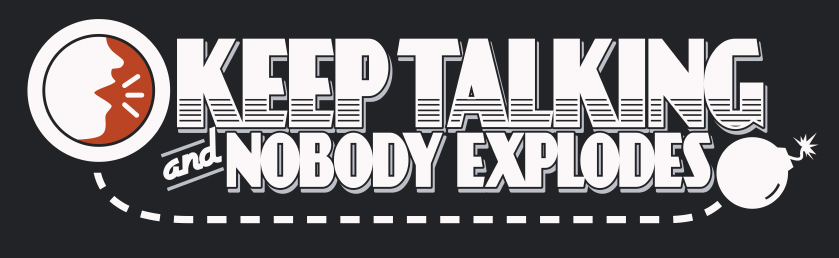

# GuideKTNE




> Projeto com intuito de auxiliar jogadores para desarmar as bombas caso o jogo fique muito difícil!

### Ajustes e melhorias

O projeto ainda está em desenvolvimento e as próximas atualizações serão voltadas nas seguintes tarefas:

- [x] Auxiliar usuário no módulo de senhas
- [x] Auxiliar usuário no módulo do diagrama de Venn
- [ ] Auxiliar usuário no módulo de código morse

## 💻 Pré-requisitos

Antes de começar, verifique se você atendeu aos seguintes requisitos:

- Você instalou a versão mais recente de `<Python>`.
- Você ter uma máquina `<Windows / Linux / Mac>`.

## ☕ Usando GuideKTNE

Para usar GuideKTNE, siga estas etapas:

Verifique se está dentro da pasta scripts para executar o comando

```
python main.py
```

## 🤝 Colaboradores

Agradecemos às seguintes pessoas que contribuíram para este projeto:

<table>
  <tr>
    <td align="center">
      <a href="#" title="CEO">
        <br>
        <sub>
          <b>Gabriel Siqueira</b>
        </sub>
      </a>
    </td>
  </tr>
</table>
